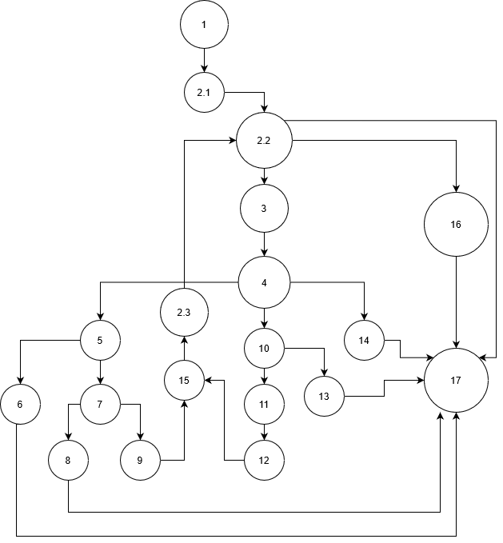
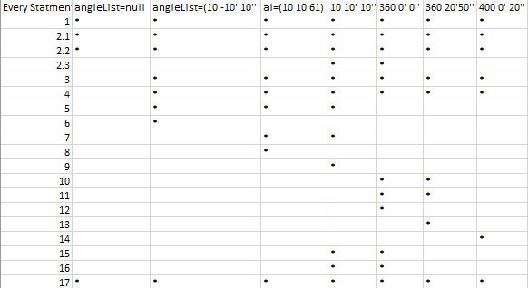
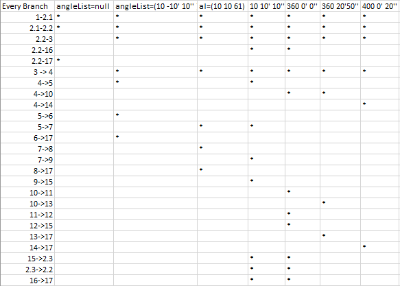
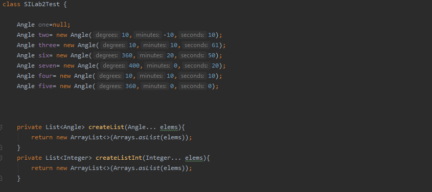
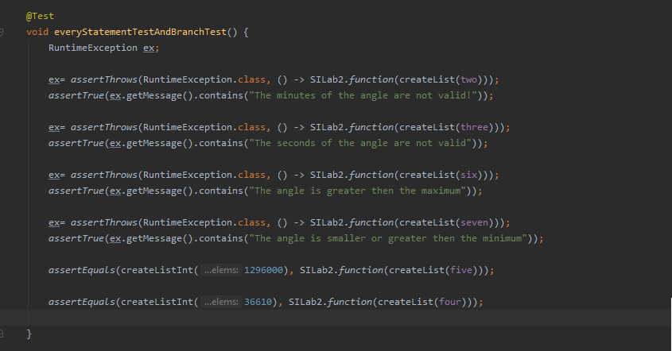

# Втора лабараториска вежба по Софтверско Инженерство
## Кирил Трбојевиќ, бр. на индекс 185063

## Група на код:
Ја добив групата на код 6

## Control Flow Graph

## Цикломатска комплексност
Цикломатската комплексност на овој код е 10, истата ја добив преку формулата *V(G)=E-N+2*, каде Е е бројот на ребра а N е бројот на јазли. E=25, N=17 
25-17+2=10

## Тест случаи според критериумот Every Statement
1. angleList=null -> Nodes 1,2.1,2.2,17
2. angleList=(10 -10' 10") -> Nodes 1,2.1,2.2,3,4,5,6,17
3. angleList=(10 10' 61") -> Nodes 1,2.1,2.2,3,4,5,7,8,17
4. angleList=(10 10' 10") -> Nodes 1,2.1,2.2,2.3,3,4,5,7,9,15,16,17
5. angleList=(360 0' 0") -> Nodes 1,2.1,2.2,2.3,3,4,10,11,12,15,16,17
6. angleList=(360 20' 50") -> Nodes 1,2.1,2.2,3,4,10,11,13,17
7. angleList=(400 0' 20") -> Nodes 1,2.1,2.2,3,4,14,17

во случаевите 1,2,3,6,7 ќе биде фрлен исклучок.

## Тест случаи според критериумот Every Branch

## Објаснување на напишаните unit tests
За тестирање на Every Statment и Every Branch методите ги употребив истите тест случаи.

